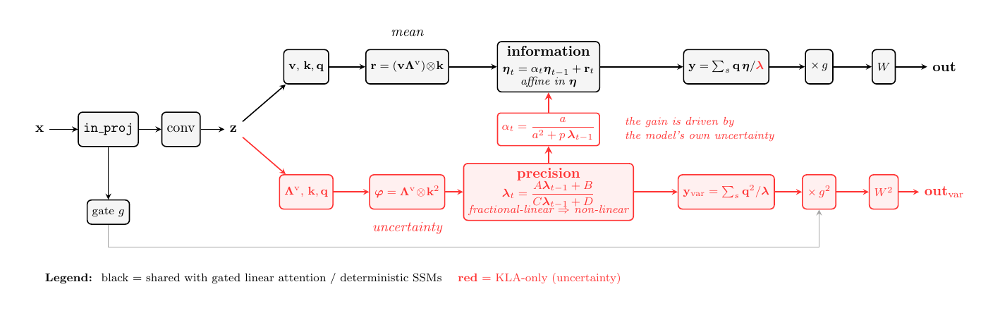
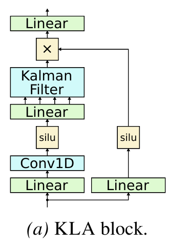

# KLA - Kalman Linear Attention

A sequence-mixing layer that is an **exact parallel Kalman filter**. Linear in
sequence length, no attention matrix.

What sets it apart: KLA **propagates uncertainty through the recurrence itself**,
and that recurrence is **non-linear** - the posterior precision evolves through a
Möbius (linear-fractional) map alongside the state. Ordinary linear attention and
SSMs carry a *linear* state recurrence and emit a point estimate, so there is
nothing to read an uncertainty off. Here every output channel comes with its own
variance: **explicit, interpretable uncertainty neurons**, one per channel per
token, at no extra cost, because the filter has to compute them anyway.

Drop it in wherever you would put attention or a Mamba block.



The outer shell (grey) is the scaffolding every gated linear attention /
deterministic SSM block already has, so it is a drop-in replacement. Inside, the
**red stream is the one no other linear mixer has**. It is not a
side-channel: the Kalman gain `alpha_t` is a function of the model's own current
uncertainty, so the red stream feeds back into the mean, and it is carried all
the way to the output through the squared gate and squared output weights. That
is what "uncertainty propagated through the recurrence" means, concretely.

## Install

```bash
git clone https://github.com/vaisakh-shaj/kalman-linear-attention.git
cd kalman-linear-attention
pip install -e .         # or:  uv pip install -e .
```

That is the whole install. No build step, no CUDA toolchain, no `flash-attn`.
The only dependency is `torch>=2.8`.

```bash
python -m kla            # prints which scan backends this machine can use
```

```
kla 0.1.0   torch 2.13.0+cu130   device: cpu
backend='auto' resolves to: torch

  [x] torch   always available; the reference implementation
  [ ] triton  needs a CUDA device
  [ ] cuda    needs a CUDA device

  forward check: KLALayer(64) -> (2, 16, 64), 63,105 params   OK
```

---

## 60 seconds

```python
import torch
from kla import KLAConfig, KLALayer

layer = KLALayer(d_model=512, config=KLAConfig(d_state=16))
y = layer(torch.randn(2, 1024, 512))        # -> [2, 1024, 512]
```

Same in/out shape as attention, so it slots into an existing block unchanged.
It runs on CPU; on a GPU it picks the fastest available kernel by itself.

<table>
<tr>
<td width="30%"></td>
<td>

**Where it goes.** `KLALayer` is the <code>Kalman&nbsp;Filter</code> box. Everything
around it - the projections, the causal conv, the SiLU gate - is the fused-MLP
scaffolding common to gated linear attention and deterministic SSMs, and
`KLALayer` already contains all of it. So the one line above is the whole block,
not just the mixer.

*(Figure 3a from the paper.)*

</td>
</tr>
</table>

**Want the uncertainty too?**

```python
layer = KLALayer(512, KLAConfig(d_state=16, return_variance=True))
y, y_var = layer(torch.randn(2, 1024, 512))  # y_var: per-token, per-channel
```

`y_var` is the filter's posterior variance, shaped exactly like `y`: one
uncertainty value per channel per token. It is not a head bolted on top and not
an ensemble - it fell out of the same non-linear recurrence that produced `y`,
so it costs nothing extra and moves with the model rather than around it.

---

## The two knobs you actually tune

```python
KLAConfig(d_state=16)      # and d_model, which you pass to the layer
```

| knob | what it does | typical | tune it? |
|---|---|---|---|
| `d_model` | model width, passed to `KLALayer(d_model, ...)` | 128 - 4096 | **yes** |
| `d_state` | filter state size per channel | **8 - 64** | **yes** |

`d_state` is the one that is specific to KLA. It is how much the filter
remembers: memory and compute scale linearly in it, and 16 is a good default.
Below 8 the filter starts to degenerate; above 64 you rarely gain.

Everything else has a sensible default and is there for research, not for
day-to-day use:

| | default | change it when |
|---|---|---|
| `expand` | `2.0` | you want a narrower/wider inner width (Mamba's convention) |
| `value_rank`, `var_rank` | `"full"` | you want the **mamba block** - see below |
| `backend` | `"auto"` | you are benchmarking, or debugging a kernel |
| `qk_norm`, `use_conv`, `use_gating`, … | on | almost never |

---

## The variants

Two architectures, one config each. Both produce identical output shapes, so
they are interchangeable.

| variant | what changes | how to build it |
|---|---|---|
| **plain** *(default)* | used for the paper's **synthetic experiments** | `KLALayer(d, KLAConfig())` |
| **mamba block** | value comes straight from the conv (as in Mamba) and the observation noise goes through a low-rank bottleneck. **~Mamba's parameter count**, and what the paper's **large-scale pretraining** uses | `KLALayer(d, KLAConfig(value_rank="conv", var_rank="dt"))` |

**Which one?** Both ship because both were used, and either reproduces the
results it belongs to: the MAD synthetic experiments are **plain**, the
pretraining runs are the **mamba block**. Quality is comparable between them, so
this is not an accuracy trade-off - pick on parameter budget.

That makes **mamba block** the one to reach for at scale, where the point is to
match Mamba's parameter count and state size at equal width: at `d_model=512` it
is 1.73M parameters against plain's 3.76M for the same widths, and the gap grows
with `d_model`.

Neither changes the scan: both emit the same shapes, so every backend runs both.

```python
from kla import KLAConfig, KLALayer

plain  = KLALayer(512, KLAConfig(d_state=16))
mamba  = KLALayer(512, KLAConfig(d_state=16, value_rank="conv", var_rank="dt"))
```

`"dt"` resolves to `ceil(d_model/16)` - Mamba's `dt_rank` convention. You can
also pass an integer for an explicit rank.

---

## Streaming / autoregressive decode

The filter is recurrent, so generation is **O(1) per token** with no KV cache.

```python
layer = KLALayer(512, KLAConfig(d_state=16))
state = layer.init_state(batch=2)

y, state = layer(prompt, state=state, return_state=True)   # prefill
for _ in range(100):
    y, state = layer(next_token, state=state, return_state=True)
```

---

## A whole language model

```python
import torch
from kla import KLAConfig, ModelConfig, SequenceModel

model = SequenceModel(
    ModelConfig(vocab_size=50257, d_model=512, n_layers=12),
    KLAConfig(d_state=16),
)
logits = model(torch.randint(0, 50257, (2, 1024)))     # [2, 1024, 50257]
text   = model.generate(prompt_ids, max_new_tokens=64)
```

---

## Backends

`backend="auto"` picks triton on a CUDA GPU and pure PyTorch otherwise. You
should not need to touch this; the table is here so nothing surprises you.

| | `torch` | `triton` | `cuda` |
|---|---|---|---|
| plain / mamba block | ✅ | ✅ | ✅ |
| carried state (decode) | ✅ | ✅ | ❌ |
| `d_state` | any | any | ≤ 64 |
| float64 (`gradcheck`) | ✅ | - | - |

`torch` is the portable reference and is not meant to be fast; the two GPU paths
are fused and are what you want on a device. `auto` already picks between them.

All three compose the precision (Möbius) recurrence the same simple way: a plain
2×2 matmul renormalized by the trace at each step, which keeps the entries O(1)
without ever leaving linear space and is stable as it stands. The torch backend
also carries a log-space composition (`mobius_impl="log"`), kept for reference as
one of the other ways the Möbius scan can be implemented.

The CUDA kernels are compiled on first use and need `nvcc`; everything else needs
nothing. Anything outside their supported subset raises a clear error rather than
silently computing the wrong thing.

Two of them ship. `backend="cuda"` selects `v2_2`, which computes exactly what
torch and triton compute and leaves bounding the inputs to you (`obs_var_min` /
`obs_var_max`, `qk_norm` / `clip_value`). `backend="cuda_v2_1"` selects a variant
that additionally clamps the per-token information gain, which holds the
posterior variance on a shorter leash on badly-scaled inputs - useful, but not
mathematically exact, since the clamp breaks a cancellation that the posterior
mean relies on. Details in
[src/kla/ops/cuda_backend.py](src/kla/ops/cuda_backend.py).

---

## What this package is not

Deliberately just the layer. No training loop, no benchmark harness, no
experiment code, no dataset glue. It is meant to be imported into whatever you
already have.

Reproduction code lives in a separate repository. It currently covers the
**MAD** synthetic-task suite ([mad-lab](https://github.com/athms/mad-lab)) - the
paper's `plain`-block experiments. The **FineWeb** pretraining runs behind the
`mamba`-block results are not in it yet; they will follow.

Not published to PyPI - install from source as above.

---

## Citation

```bibtex
@article{shaj2026kla,
  title  = {Kalman Linear Attention: Parallel Bayesian Filtering For Efficient
            Language Modelling and State Tracking},
  author = {Shaj, Vaisakh and Barker, Cameron and Scannell, Aidan and
            Szecsenyi, Andras and Crowley, Elliot J. and Storkey, Amos},
  year   = {2026},
  eprint = {2602.10743},
  url    = {https://arxiv.org/abs/2602.10743},
}
```

MIT licensed.
